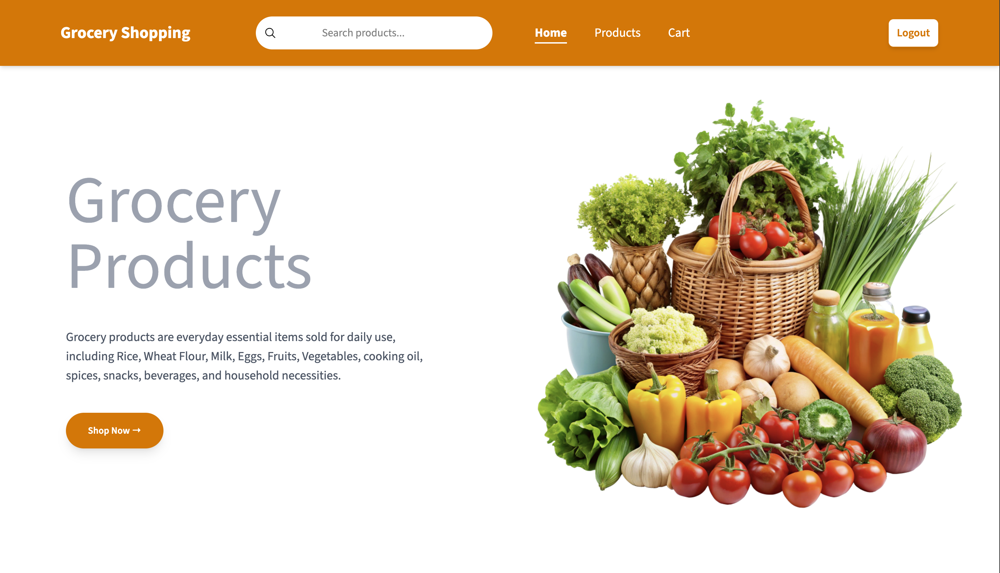

# 🛒 Grocery E-Commerce Web App

A full-stack grocery shopping web application where users can browse products, search, filter by category, and manage cart items. Admin can add, update, and delete products with image upload support.

---

## 🚀 Features

### 👤 User
- Browse products
- Search products
- Filter by categories (Fruits, Vegetables, Meats, Oils)
- Add to cart
- Increase / decrease quantity
- View total price

### 🔐 Admin
- Add new products
- Upload product images (Cloudinary)
- Edit products
- Delete products

---

## 🧱 Tech Stack

### Frontend
- React.js
- Tailwind CSS
- React Router

### Backend
- Node.js
- Express.js

### Database
- MongoDB

### Other Tools
- Cloudinary (Image Upload)
- JWT Authentication

---

## 📁 Project Structure
- E-COMMERCE_WEBSITE/
- │
- ├── Frontend/
- ├── Backend/
- └── README.md

## ⚙️ Installation

### 1️⃣ Clone Repository

```bash
git clone https://github.com/MujaheedAliKhan/Grocery-Shopping-App.git
cd Grocery-Shopping-App
```

### 2️⃣ Backend Setup
```bash
cd Backend
npm install
npm start
npm run dev
```

### 3️⃣ Frontend Setup
```bash
cd Frontend
npm install
npm run dev
```



## ✨ Future Improvements
Payment Integration
Order History
Wishlist Feature
Admin Dashboard
Responsive improvements

## 📌 Author
### Lavani Mujaheed Ali Khan